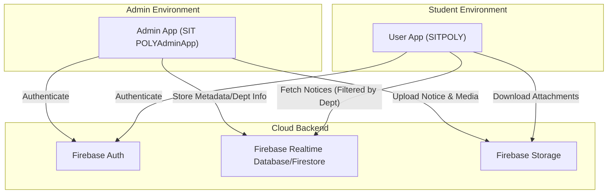

# SITCOE_College_App
Developed the SITCOE College App to help students and teachers manage daily activities efficiently.  Implemented a filter feature enabling teachers to upload notices targeted to specific departments,  and utilized Firebase Custom Authentication for secure user login. 


## 1. What is this repo?

The `SITCOE_College_App` repository contains the source code for a mobile-based college management system designed for the Sharad Institute of Technology College of Engineering (SITCOE) and Polytechnic. The project is split into two distinct Android applications: a **User App** for students and a **Admin App** for faculty and administrators.

The primary purpose of this system is to streamline communication and management within the institution. According to the `README.md` at the root and within `SIT_App-main/README.md`, the applications facilitate:
*   **Notice Management:** Teachers can upload notices that are filtered by specific departments, ensuring students only see relevant information.
*   **Secure Access:** The system utilizes Firebase Custom Authentication to manage secure logins for different user roles.
*   **Daily Activity Management:** Tools to help students and teachers track and manage institutional tasks.

The repository includes the full Android project source code for both applications, including Gradle configuration files, wrapper scripts, and resource directories.

## 2. How all main components connect

The architecture follows a classic Client-Server-Client pattern using Firebase as the central backend-as-a-service (BaaS). The system architecture consists of three main components: the Admin Android client, the User/Student Android client, and the Firebase cloud infrastructure.



### Component Interaction Detail:
1.  **Authentication Flow:** Both applications use `Firebase Custom Authentication` (as mentioned in `README.md`) to verify user identities. This ensures that only authorized staff can access the admin features.
2.  **Admin Upload Flow:** When an administrator in `SIT_App-main/SIT POLY - AdminF1 App/` uploads a notice, they select a department filter. The app sends the notice metadata to the database and any images or documents to Firebase Storage.
3.  **User Consumption Flow:** The student app in `SIT_App-main/SIT POLYF3/SITPOLY/` queries the backend. Based on the user's profile or selected filters, the app retrieves and displays notices specifically targeted at their department.

## 3. Repository Structure

```shell
SITCOE_College_App/
├── README.md
└── SIT_App-main/
    ├── README.md
    ├── SIT POLY - AdminF1 App/
    │   ├── SITPOLYAdminApp/
    │   │   ├── app/
    │   │   ├── build.gradle
    │   │   ├── gradle/
    │   │   ├── gradlew
    │   │   └── settings.gradle
    │   └── SIT POLY - AdminF1 App.zip
    ├── SIT POLYF3/
    │   └── SITPOLY/
    │       ├── app/
    │       ├── build.gradle
    │       ├── gradle/
    │       ├── gradlew
    │       └── settings.gradle
    ├── SIT POLYF3.zip
    └── ...
```

## 4. Other important information

### Tech Stack
*   **Platform:** Android (Java/Kotlin).
*   **Build System:** Gradle (visible via `SIT_App-main/SIT POLYF3/SITPOLY/build.gradle`).
*   **Backend:** Firebase (Authentication and likely Realtime Database or Firestore for notice distribution).
*   **UI/UX:** The project includes splash screens and multi-tabbed layouts for different college departments, as seen in the preview images in `SIT_App-main/README.md`.

### Key Features
*   **Department Filtering:** A core logic component that allows granular control over who sees specific notices, preventing information overload for students.
*   **Dual-App Ecosystem:** By separating the Admin and User logic into two different apps (`SIT POLYAdminApp` and `SITPOLY`), the developers have enforced a hard security boundary between student and faculty capabilities.
*   **Asset Management:** The repository contains `.zip` backups of various versions (e.g., `SIT POLY2.1.zip` inside `SIT_App-main/SIT POLYF3/SITPOLY/`), suggesting an iterative development process where specific milestones were archived directly within the structure.

### Development Environment
To work with this repository, a developer would need **Android Studio**. Both main directories (`SIT_App-main/SIT POLY - AdminF1 App/SITPOLYAdminApp/` and `SIT_App-main/SIT POLYF3/SITPOLY/`) are structured as independent Android projects that can be imported and built using the provided `gradlew` scripts.
